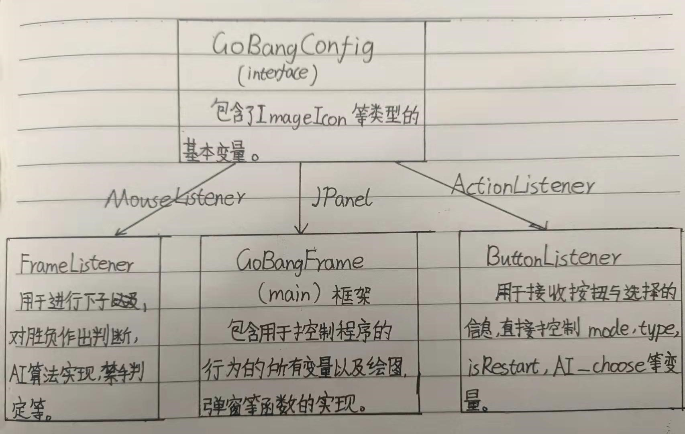
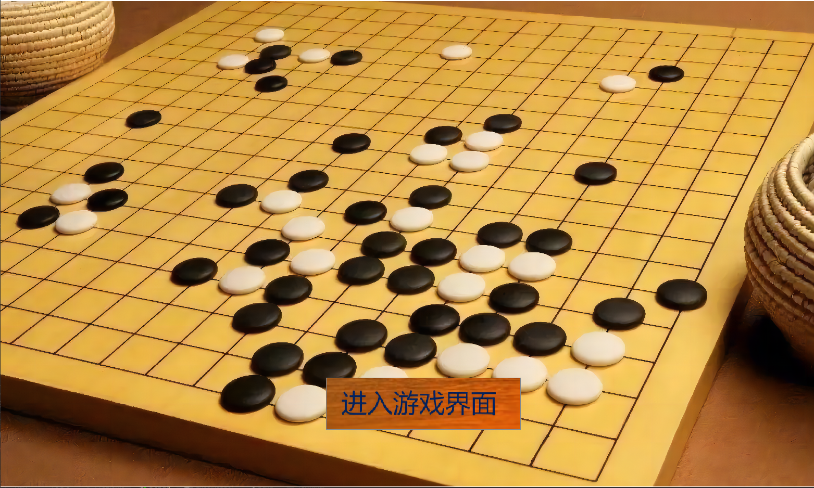
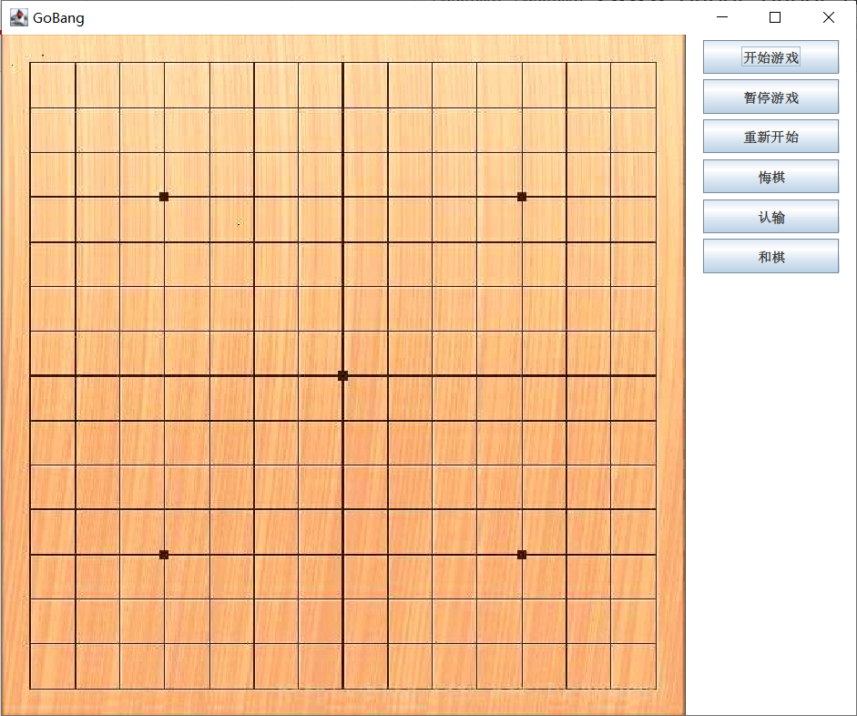
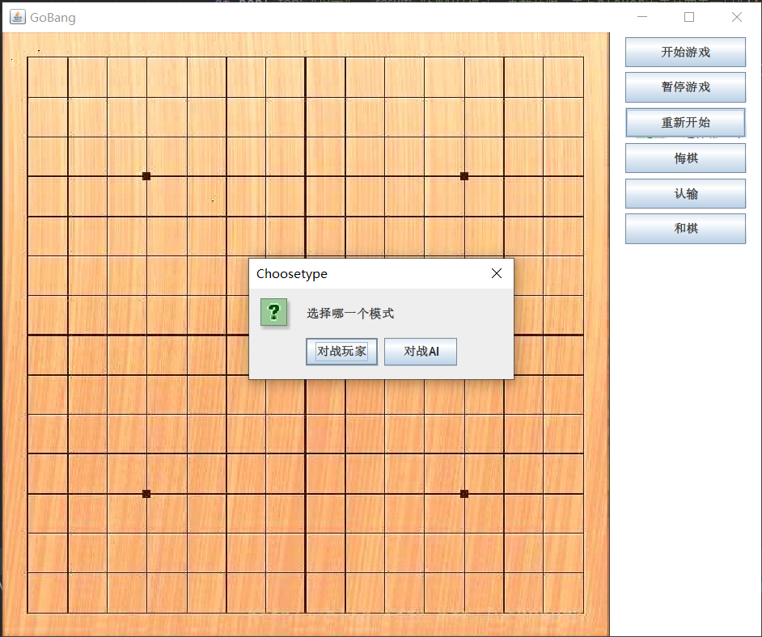
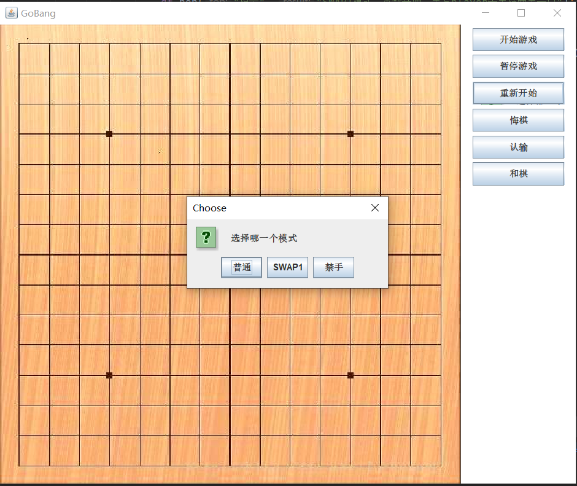
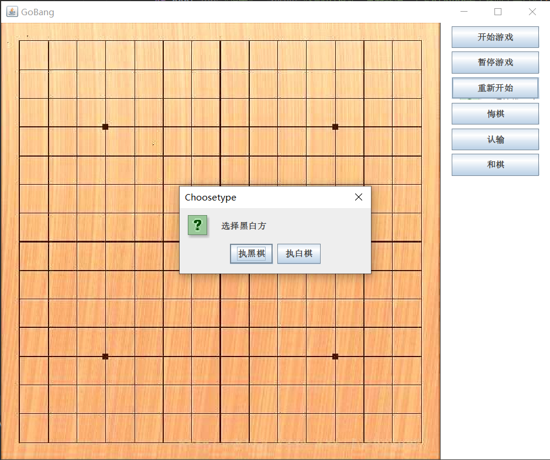

# Five-Stars-Collinear

---

作者：李延儒

---

1. 功能文档：现在五子棋的单机版本及相关的美工优化已解决，实现了相关的普通版本以及进一步的更复杂的SWAP1功能和禁手功能。并搭建了相关的jar包，并实现了AI对战，完成了基于评估函数的决策树的构建以及α_β剪枝算法的优化。AI功能包括普通模式的黑白方(由玩家自己决定),禁手模式的黑白方(也由玩家自己决定),SWAP1模式下的初始黑方需是玩家，玩家先手摆放两黑一白后，AI会进行决策，选择是否与黑方持子者进行交换。

2. 代码文档：使用了java 语言，所用的编译器是Intellij IDEA，java版本为jdk-17，主要使用了java的前端组件（如swing组件与awt组件）实现相关的图片调用，主要利用JButton实现的相关功能选择，以JFrame，JPanel以及重载其自带的paint功能，结合awt，鼠标监听效果及二维数组形成五子棋的效果。

代码共有7个java class和一个java interface，分别实现构建初始进入游戏窗口功能，进入游戏选择页面功能，控制按钮选择功能以及监听鼠标点击落子功能。主要的三个类FrameListener, GoBangFrame，ButtonListener类图如下：

禁手的AI功能较为复杂，且估值函数繁琐，很容易出现从很高的分数直接变为很低的分数，为防止联合算法出现失真情况，我在初始时会根据禁手规则下的不同模式，赋予权重，与之后的估值函数相加，获得相关的权重值。

3. 软件文档：程序运行后，会出现如下的进入游戏的界面。

点击进入游戏界面进入后，会出现：

刚进入游戏时，只能点击开始游戏：

选择开始游戏后：会出现选择对战玩家或对战AI的选择窗口，选择相关模式即可，以选择对战AI为例。

选择对战AI后，可以选择三个模式，选择进入即可。

若选择普通或是禁手模式，会出现选择窗口，选择执棋即可，黑方先手，白方后手，在禁手模式下，黑方会禁手受限制。

若选择SWAP1模式，则会默认玩家执黑子，先手摆两黑一白后由AI决定是否交换持子。

选择相关模式即可，选择相关模式后，会出现对应模式的简介。其他功能如暂停游戏，重新开始，悔棋，认输和棋等功能较为简单，故不再介绍，在游戏结束后，需要点击重新开始才能进入新的游戏选择界面。游戏结束时，无法下棋，在进行悔棋，和棋等操作时也会有相关的如游戏已结束的提示。

